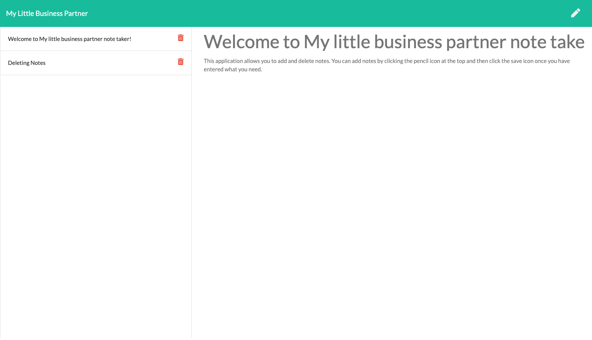

# My-little-business-partner
[](https://github.com/donglee0415/My-little-business-partner/issues) [](https://github.com/donglee0415/My-little-business-partner/graphs/contributors) 

## Description
This application allows you to add and delete notes. You can add notes by clicking the pencil icon at the top and then click the save icon once you have entered what you need.
            
View the deployed page at [My-little-business-partner](https://github.com/Donglee0415/My-little-business-partner).
## Contents
* [Installation](#installation)
* [Usage](#usage)
   * [Screenshots](#screenshots)
* [Built With](#built-with)
* [License](#license)
* [Contributing](#contributing)
* [Questions](#questions)
* [Credits](#credits)

## Installation
To use this application, please install: 
```
NPM install express
```
    
## Usage
To use this application, please install: NPM install express 
    
### Screenshots



## Built With

* HTML
* CSS
* JavaScript
* Node.js
* Express.js


## Questions
If you have any questions about the repo, please [open an issue](https://github.com/donglee0415/My-little-business-partner/issues) or contact me via email at dn.lee0415@gmail.com. You can find more of my work on my GitHub, [donglee0415](https://github.com/donglee0415/).
    


    
